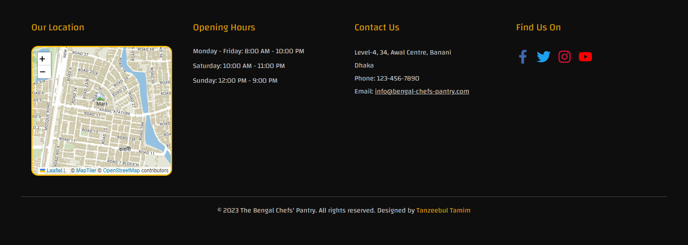
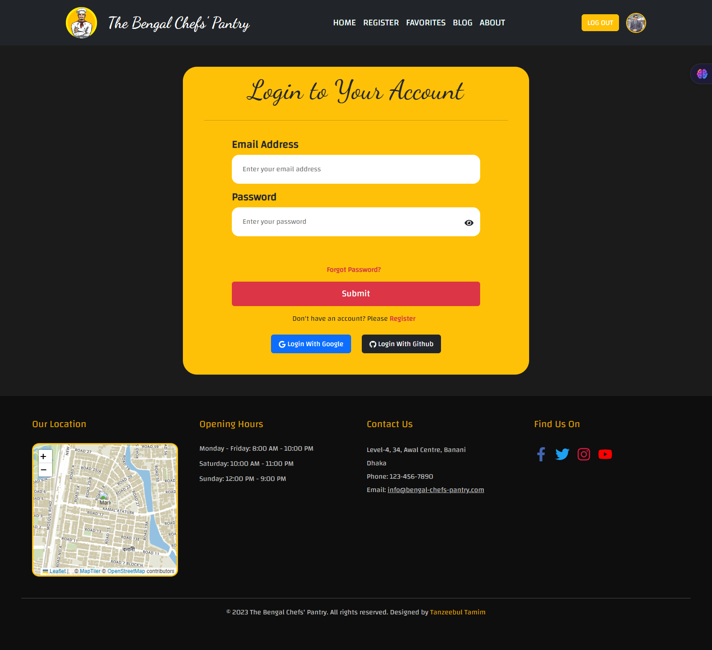
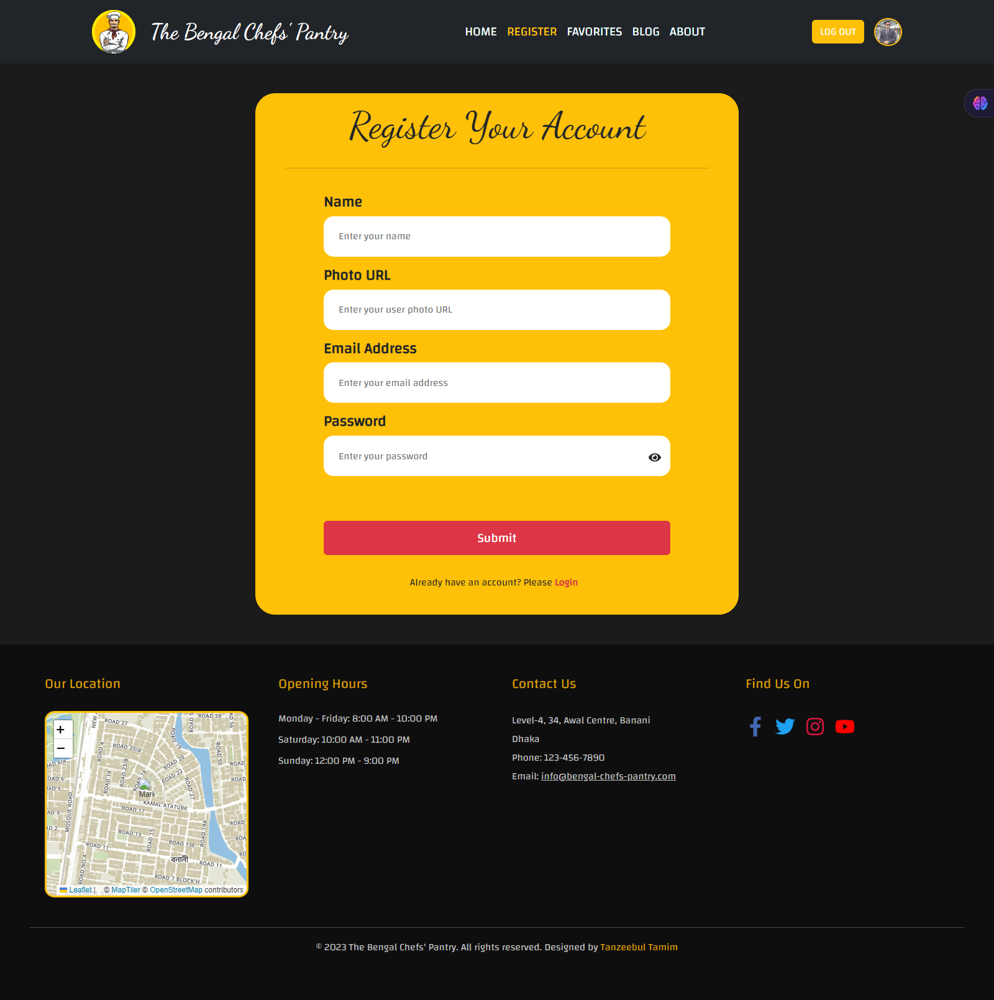
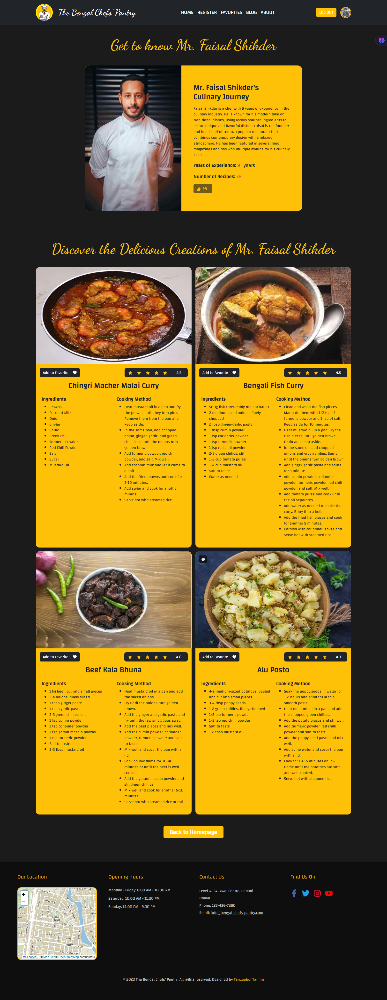
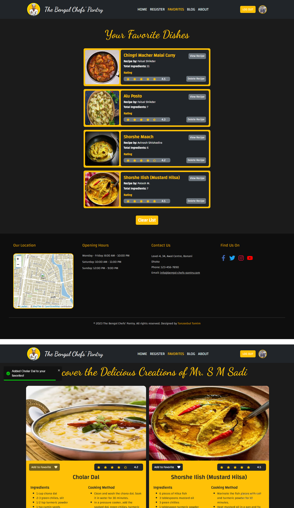
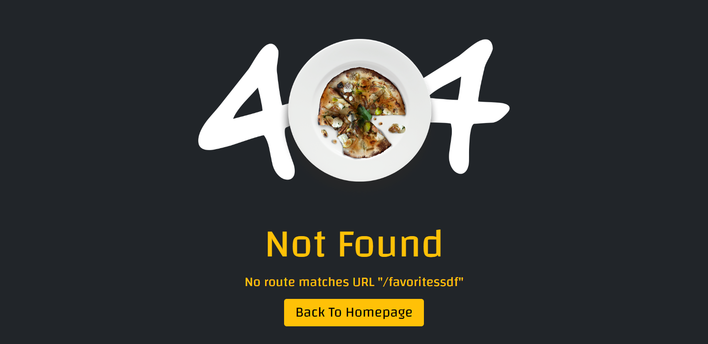

#  The Bengal Chefs' Pantry - Client Side

Welcome to the client-side repository of The Bengal Chefs' Pantry website, a dedicated website showcasing the finest recipes from the best chefs.

## Table of Contents
- [Website Features](#website-features)
- [Live Deployment](#live-deployment)
- [Used Packages and Technologies](#used-packages-and-technologies)
- [Prerequisites](#prerequisites)
- [Installation](#installation)
- [Running the Project](#running-the-project)
- [Also Checkout The Bengal Chefs' Pantry - Server](#also-checkout-the-bengal-chefs-pantry-server)
- [Contributing](#contributing)
- [License](#license)

## Website Features

- ***Unique Design:*** The website features a unique and visually appealing design tailored to showcase recipes from Bengali cuisine. Each page is designed to provide an immersive experience for users interested in culinary exploration.
<p align="center">
  
</p>

<br/>

- ***Dynamic Home Page:*** The homepage features a banner containing 6 top rated dishes, a scrolling ticker containing fun facts, top chefs section containing chefs' name, years of experience, number of recipes, likes and a button that redirects to a page allocated for their detailed recipes, a section called "expert chef tips and tricks" which includes a slider with tips and tricks related images and finally a section regarding healthy eating tips.
<p align="center">
   
</p>

<br/>

- ***Footer:*** A meaningful footer is present on all pages, including a mini map, ensuring consistency and providing essential links or information.
<p align="center">
  
</p>

<br/>

- ***Registration & Login System:*** Users can register with their name, email, password, and photo URL and can login using email and password. Both pages include error handling for invalid inputs.
  - ***Login:***
  <p align="center">
     
  </p>

  - ***Register:***
  <p align="center">
     
  </p>

<br/>

<br/>

- ***Chef Section on Homepage:*** The homepage features a section showcasing chefs, including their picture, name, years of experience, number of recipes, likes, and a button to view their recipes.
<p align="center">
  
</p>

<br/>

- ***Chef Recipes Page:*** Users can view detailed information about a chef, including their picture, bio, likes, number of recipes, and years of experience. Recipes are displayed in a tabular or card format, including recipe name, ingredients, cooking method, rating, and a Favorite button.
<p align="center">
  
</p>

<br/>

- ***Favorite Recipe Feature:*** Users can mark recipes as favorites, triggering a toast message and disabling the favorite button upon selection.
<p align="center">
  
</p>

<br/>

- ***404 Page:*** A custom 404 page is created with an added picture, enhancing the user experience in case of page not found errors.
<p align="center">
  
</p>

<br/>

## Live Deployment

Check out the live site [at this following URL](https://fir-practice-42e37.web.app/)

## Used Packages and Technologies

- **React**: Core library for building user interfaces
- **React Router**: For routing and navigation
- **Bootstrap**: Front-end component library for UI design
- **Firebase**: For authentication
- **Leaflet**: For interactive map
- **LocalForage**: For offline storage
- **Match-sorter**: For fuzzy filtering and sorting
- **React Icons**: For iconography
- **React Toastify**: For toast notifications
- **React Rating**: For rating components
- **React Fast Marquee**: For scrolling text effects

## Prerequisites

- Node.js
- npm

## Installation

1. Clone the repository:
   ```sh
   git clone https://github.com/Tanzeebul-Tamim/The-Bengal-Chefs-Pantry-Client
   cd The-Bengal-Chefs-Pantry-Client
   ```
2. Install dependencies:
   ```sh
   npm install
   ```

## Running the Project

```sh
npm run dev
```

## Also checkout The-Bengal-Chefs-Pantry-Server

Visit the server-side repository of [The Bengal Chefs' Pantry](https://github.com/Tanzeebul-Tamim/The-Bengal-Chefs-Pantry-Server) website

## Contributing

Feel free to contribute by submitting a pull request. Please ensure that your code follows the project's coding standards and includes relevant tests.

## License

This project is licensed under the MIT License - see the [LICENSE](LICENSE) file for details.
